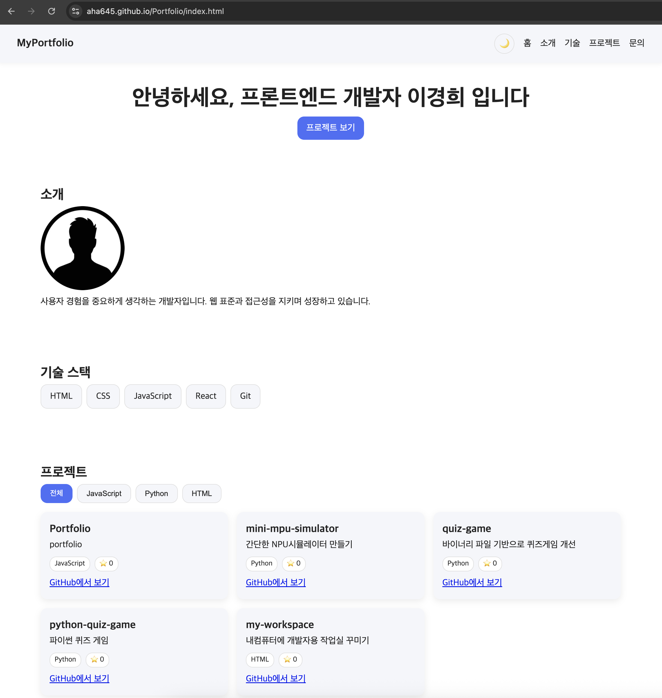
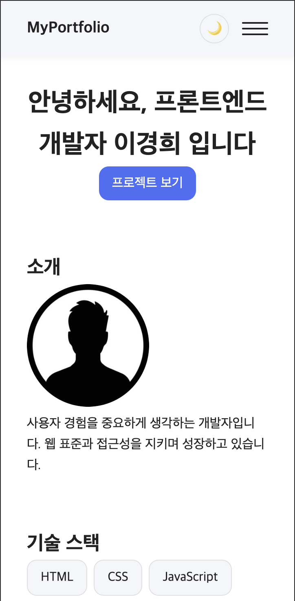
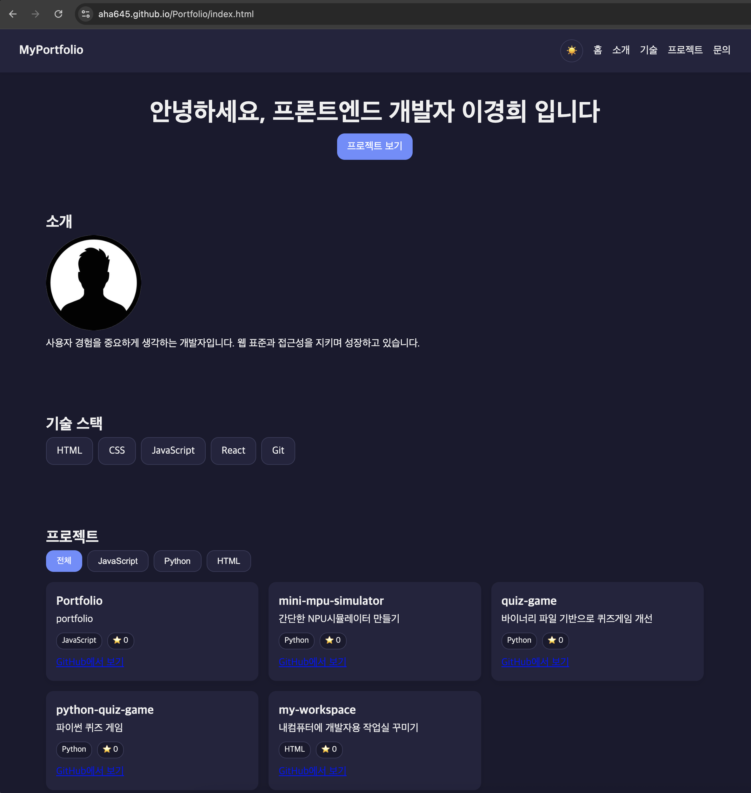
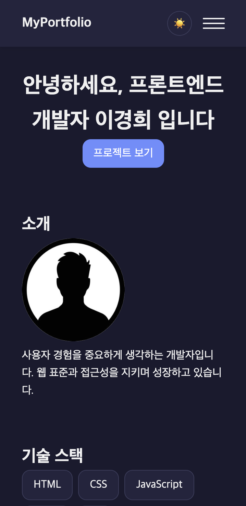

# 반응형 포트폴리오 웹사이트

HTML/CSS/JavaScript(순수 바닐라)로 제작한 반응형 포트폴리오 사이트입니다.
다크 모드, GitHub API 연동 프로젝트 목록, 폼 유효성 검사 및 실제 전송을 프레임워크 없이 구현했습니다.

## 배포 URL

- GitHub 저장소: https://github.com/aha645/Portfolio
- GitHub Pages: https://aha645.github.io/Portfolio/

**배포 절차**: 저장소 Settings → Pages → Source를 `main` 브랜치 `/ (root)`로 설정 → Save.
몇 분 뒤 `https://{계정}.github.io/{저장소명}/`에서 접속 가능합니다.

## 스크린샷

| 화면 | 데스크톱 | 모바일 |
|---|---|---|
| 라이트 모드 |  |  |
| 다크 모드 |  |  |

## 사용 기술

- **HTML5**: 시맨틱 태그(`header`/`nav`/`main`/`section`/`article`/`footer`)
- **CSS**: Flexbox, Grid, CSS 변수(Custom Properties) 등 모던 CSS 모듈 + `@media`/`transition`/`@keyframes`(CSS3)
- **JavaScript (ES6+)**: 화살표 함수, 구조분해 할당, 템플릿 리터럴, `async`/`await`
- **배열 메서드 (ES5+)**: `map`/`filter`/`forEach`
- **Web API**: `fetch`, `IntersectionObserver`, `localStorage`, `matchMedia`
- **아키텍처**: 단일 `STATE` 객체 기반 상태 관리
- **GitHub REST API**: `GET /users/{username}/repos`
- **EmailJS**: 문의 폼 실제 이메일 전송 (SMTP Server로 네이버 메일 연결)
- **배포**: GitHub Pages

## Flexbox vs Grid 선택 기준

한 줄/한 열 정렬이면 Flexbox, 여러 줄에서도 열 너비가 정확히 맞아야 하면 Grid를 썼습니다.

| 위치 | 선택 | 이유 |
|---|---|---|
| `nav` ([css/style.css:98](css/style.css#L98)) | Flexbox | 로고-메뉴 양 끝 배치만 하면 되는 1차원 정렬 |
| `#skills-list`, `.filters` ([css/style.css:339](css/style.css#L339)) | Flexbox + wrap | 태그처럼 줄바꿈만 필요, 줄 간 정렬 불필요 |
| `#projects-list` ([css/style.css:366](css/style.css#L366)) | Grid | 카드가 여러 줄이어도 열 너비가 항상 같아야 함 (`auto-fit`, `minmax`) |

## 구조 설명서

각 코드를 **왜 그렇게 작성했는지**는 별도 문서로 정리했습니다 — 색상 토큰 설계,
Flexbox/Grid 선택 기준, 명시도 원칙, 기능별 동작 흐름, `id`/`class` ↔ CSS ↔ JS 대응표.

📄 **[docs/ARCHITECTURE.md](docs/ARCHITECTURE.md)**

## 폴더 구조

```
Portfolio/
├── index.html         # 메인 페이지 (시맨틱 마크업)
├── css/style.css      # 전체 스타일시트
├── js/script.js       # 인터랙션 / 상태 관리 / API 연동
├── data/info.json     # Hero·About·Skills·Footer 콘텐츠 데이터
├── docs/ARCHITECTURE.md  # 구조 설명서 (설계 의도 · 동작 흐름)
├── images/            # 프로필 사진 등 이미지 리소스
└── README.md
```

## 기준값 (자유 변경 가능, `js/script.js` 상단 상수)

| 기능 | 기준값 | 상수명 |
|---|---|---|
| 네비게이션 배경 변경 스크롤 위치 | `60px` | `NAV_SCROLL_THRESHOLD` |
| 스크롤 탑 버튼 표시 스크롤 위치 | `300px` | `SCROLL_TOP_THRESHOLD` |
| 스크롤 등장 애니메이션 임계값 | `0.2` | `REVEAL_THRESHOLD` |
| GitHub API 요청 타임아웃 | `8000ms` | `FETCH_TIMEOUT_MS` |
| Hero 타이핑 효과 속도 | 글자당 `80ms` | `TYPING_SPEED_MS` |
| 반응형 브레이크포인트 | `768px`(태블릿), `1024px`(데스크톱) | `css/style.css` `@media` |

**검증**: 개발자도구 반응형 모드에서 폭을 767→768px, 1023→1024px로 넘기며 햄버거/네비/카드 레이아웃 전환을 확인합니다.

## GitHub API 에러 문구

상태 코드별로 다른 문구를 보여줍니다 (`getGitHubErrorMessage()`).

| 상황 | 표시 문구 |
|---|---|
| 403 (요청 한도 초과) | GitHub API 요청 한도를 초과했습니다. 잠시 후 다시 시도해주세요. |
| 404 (사용자 없음) | 해당 GitHub 사용자를 찾을 수 없습니다. |
| 5xx (서버 오류) | GitHub 서버에 일시적인 문제가 발생했습니다. |

## 상태(state) → 렌더링 흐름

단일 `STATE` 객체와 `setState()`로 "이벤트 → 상태 변경 → 화면 갱신"을 한 방향으로 강제합니다.

```js
const STATE = {
  theme, navOpen, scrolled, showScrollTop,
  projects: { status, items, username, message, filter },
  formErrors, formStatus, formMessage,
};
```

| 상태 | 이벤트 | 렌더링 |
|---|---|---|
| 다크 모드 (`theme`) | 토글 클릭 / OS 설정 변경 | 전체 배색 전환 |
| 메뉴 열림 (`navOpen`) | 햄버거 클릭 / `Esc` | 드롭다운 표시·숨김 |
| 프로젝트 (`projects`) | 로드 / 재시도 / 언어 필터 클릭 | 로딩·성공·에러·빈 상태 + 카드 필터링 |
| 폼 (`formErrors`/`formStatus`) | 입력 / 제출 | 에러 메시지, 전송 상태 문구 |
| 스크롤 (`scrolled`/`showScrollTop`) | 스크롤 | 헤더 배경, 스크롤탑 버튼 표시 |

`setState`는 바뀐 상태에 매핑된 render 함수만 실행하므로, 스크롤처럼 잦은 이벤트가 무관한
영역(프로젝트 카드 등)까지 다시 그리지 않습니다. Hero/About/Skills/Footer 콘텐츠는 로드 시
한 번만 채워지는 정적 값이라 `STATE`에 포함하지 않았습니다.

Hero 타이핑 효과는 시스템의 "동작 줄이기"(`prefers-reduced-motion`) 설정을 감지해, 켜져 있으면
애니메이션 없이 문구를 즉시 전체 표시합니다.

새 기능을 추가할 땐 `projects`처럼 관련 상태를 하나의 하위 객체로 묶고, `RENDERERS`에 담당
render 함수를 매핑하는 패턴을 따릅니다.

## 문의 폼 실제 전송 설정 (EmailJS + 네이버 SMTP)

Gmail 대신 **SMTP Server 서비스로 네이버 메일**을 연결해 실제 이메일이 전송되도록 구성했습니다.

1. 네이버 메일 → 환경설정 → POP3/IMAP 설정 → "SMTP 사용" 활성화 (2단계 인증 시 애플리케이션 비밀번호 발급)
2. EmailJS → Email Services → Add New Service → **SMTP Server**
   - SMTP Server: `smtp.naver.com` / Port: `587`(STARTTLS) 또는 `465`(SSL)
   - Username / Password: 본인 네이버 메일 주소 / 위 비밀번호
3. Email Templates에서 `{{name}}`, `{{email}}`, `{{message}}` 변수로 템플릿 작성, To Email은 본인 메일 주소, Reply To는 `{{email}}`
4. 발급된 Service ID / Template ID / Public Key를 [js/script.js](js/script.js)의 `EMAILJS_*` 상수에 채워 넣기 (이미 채워져 있어 바로 동작)

## 접근성 체크리스트

- Tab 키만으로 메뉴·폼 전체 탐색 가능
- 햄버거 메뉴 열림 상태에서 `Esc`로 닫힘, 포커스가 버튼으로 복귀
- 폼 에러/전송 상태는 `role="status"`/`aria-live`로 스크린리더에 자동 안내

## 로컬 개발 환경

1. VS Code에서 프로젝트 폴더 열기
2. `Live Server` 확장 설치 후 `index.html`에서 우클릭 → "Open with Live Server"
3. GitHub API 확인: `data/info.json`의 `github.username`을 본인 GitHub 아이디로 설정
